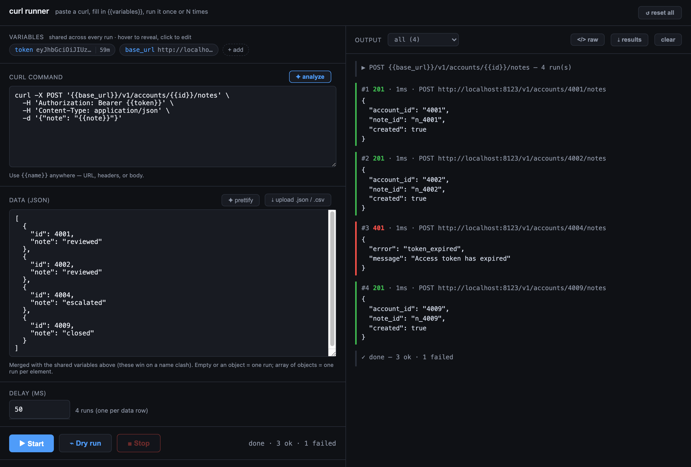
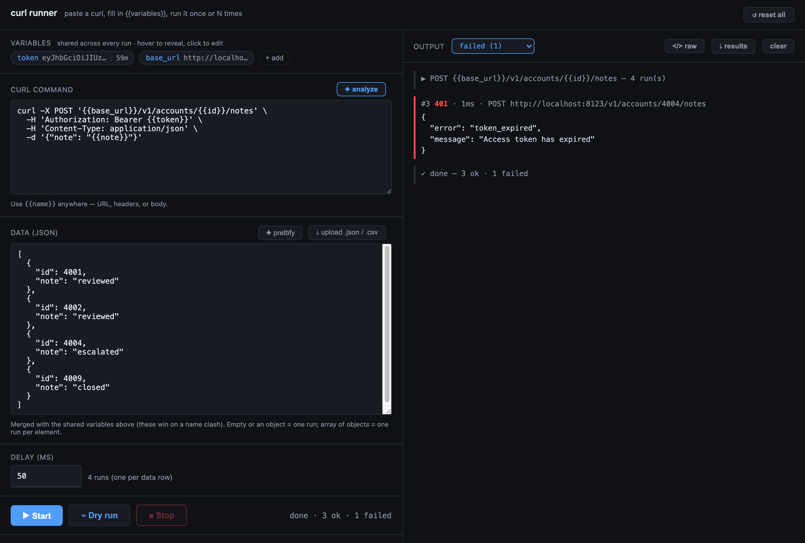

# curl runner

[](https://github.com/jlwilk/curl-runner/actions/workflows/test.yml)
[](LICENSE)

Paste a `curl` command, fill in `{{variables}}`, and run it once or a set
number of times, with a delay between runs. Responses stream into the output
box live. Start and Stop whenever you want.

It runs the request **server-side** (a tiny Node process), so there are no
CORS headaches the way there would be firing requests straight from a browser.



## Features

- **Paste any curl** — `{{placeholders}}` work in the URL, headers, or body.
  Runs server-side, so there are no CORS limits.
- **Shared variables (chips)** — single values reused across every run (token,
  base URL) live in a chip bar at the top: **hover to reveal** the value, **click
  to edit**, **+ add** your own. A JWT chip shows a **live countdown** to expiry.
- **Per-run data (JSON)** — the data that changes each request. A JSON *object*
  (or empty) runs once; a JSON *array* runs once per element (one request per
  row). Data is merged with the shared variables, and wins on a name clash.
- **Runs & delay** — set a delay between runs and, for a single data set, how
  many times to run it (the box hides when the data already has multiple rows,
  since the rows set the count). **Start / Stop** any time; Stop aborts instantly.
- **Undefined vars are dropped** — if a `{{var}}` isn't provided by the data or a
  chip, it's omitted from the request (the query param, header, or JSON body
  field is removed) rather than sent literally, and you get a warning.
- **Live streaming output** — each response appears as it returns, with status,
  timing, and pretty-printed JSON. A run ends with an `X ok / Y failed` summary.
- **Filter the output** — a status dropdown over the results: the `failed` / `ok`
  groups, or a single code (`401`, `500`, or `ERR` for network failures), each
  with a live count. The run header and `X ok / Y failed` summary stay visible so
  a filtered pane keeps its context, and the filter **sticks across runs** — set
  it to `failed` once and every re-run shows you just the failures.
- **`</>` Raw view** — toggle any result to show the exact request that was sent
  (as a reconstructed curl) and the unprettified raw response.
- **⌁ Dry run** — preview the fully-substituted requests (method, URL, headers,
  body) without sending them — handy before firing a batch of `DELETE`s.
- **Download results** — export the last run's per-request results (status,
  timing, response) to CSV.
- **Pre-flight token check** — on Start, warns if a variable is an
  already-expired JWT (so you refresh before getting a wall of 401s).
- **Auto-save** — your curl, variables, delay, run count, and view settings
  persist in the browser, so a refresh never wipes a pasted curl.
- **✦ Analyze a raw browser curl** — one click pulls the `Bearer` token into a
  `{{token}}` chip (with JWT time-to-expiry), and turns JSON body fields and URL
  query params into `{{variables}}` with example values in the data box.
- **JSON / CSV upload** — load variables from a `.json` file, or a `.csv` whose
  header row becomes the keys (one object per row).
- **✦ Prettify & repair** — reformat the variables JSON, and auto-wrap a bare
  comma-separated list in `[ ]`.
- **Helpful JSON errors** — a parse error points at the exact spot (`◀here▶`)
  and detects the common "missing surrounding `[ ]`" mistake.
- **Auto-growing inputs** — the curl and variables boxes resize to fit what you
  paste (up to a cap, then scroll).
- **One-command run** — `make local` (with hot-reload) or `make up` (Docker).

## Quick start

```bash
git clone <your-repo-url> curl-runner
cd curl-runner
make local     # run with Node (installs deps first)
# or
make up        # build and run in Docker
```

Open http://localhost:2875. Override the port on any target: `make local PORT=9999`.

Run `make` (or `make help`) to see all targets:

| Target        | What it does                                      |
| ------------- | ------------------------------------------------- |
| `make local`  | Run locally with Node (installs deps first)       |
| `make up`     | Build and run in Docker                           |
| `make down`   | Stop the Docker container                         |
| `make logs`   | Tail the Docker container logs                    |
| `make clean`  | Remove `node_modules` and stop Docker             |

Prefer the raw commands? `npm install && npm start`, or `docker compose up --build`.
Node 20+ required for the non-Docker path.

## How it works

1. **curl command** — paste any `curl`. Use `{{name}}` placeholders anywhere:
   in the URL, headers, or body. Or paste a raw curl (e.g. Chrome DevTools'
   "Copy as cURL") and hit **✦ analyze** to templatize it automatically — see
   below.
2. **variables** (top chip bar) — single values shared across every run, like a
   `token` or `base_url`. Hover a chip to reveal its value (and a JWT's expiry),
   click to edit, **+ add** to create one. Analyze drops the Bearer token here.
3. **data (JSON)** — the values that change per request, merged with the shared
   variables above (data wins on a name clash):
   - Empty, or an **object** (`{ "id": "1" }`), runs once — set **runs** to repeat
     it (e.g. to poll an endpoint).
   - An **array** (`[ { "id": "1" }, { "id": "2" } ]`) runs **once per element**,
     iterating your data.
   - **Upload** a `.json` file, or a `.csv` whose header row becomes the keys —
     each data row turns into one object in the array. The box shows the loaded
     filename and item count.
   - Any `{{var}}` not provided here or by a chip is **dropped** from the request.
4. **delay (ms)** and **runs** — wait between runs, and how many times to run a
   single data set (the runs box hides when the data has multiple rows).
5. **Start / Stop** — Stop aborts mid-run immediately. Use **⌁ Dry run** to
   preview requests without sending, the **status dropdown** to narrow the output
   to failures (or one status code), and **`</>` raw** to inspect the exact
   request and raw response of any result. Each Start begins a fresh output pane.

The same run, narrowed to what went wrong. The run header and summary stay put,
so the context doesn't disappear along with the requests that passed:



### Analyze: turn a raw curl into a template

Paste a curl copied from your browser's network tab and click **✦ analyze**. It:

- pulls the `Bearer` token out of the `Authorization` header into a `{{token}}`
  chip, and shows how long until the JWT expires (and who it's for);
- converts each JSON body field into a `{{field}}` placeholder;
- converts URL query-string values into `{{param}}` placeholders;
- seeds the data box with the example values it found.

So a 30-header browser curl with an inline token and JSON body becomes a clean
template, a `{{token}}` chip, and a ready-to-edit data object in one click.
Numbers stay numbers, strings stay strings, and Chrome's `$'...'` quoting is
handled.

### Example: iterate over a list

Set `token` once in the shared-variable chips, then put the changing data below.

curl:
```
curl -X DELETE https://api.example.com/accounts/history/{{id}} \
  -H 'Authorization: Bearer {{token}}' \
  -H 'Content-Type: application/json' \
  -d '{"note": "cleanup"}'
```

data:
```json
[
  { "id": "101" },
  { "id": "102" },
  { "id": "103" }
]
```

That fires three DELETEs, one per `id`, each reusing the shared `{{token}}`,
with the configured delay between them.

## Supported curl flags

`-X/--request`, `-H/--header`, `-d/--data/--data-raw/--data-binary/--data-urlencode`,
`-u/--user` (basic auth), `-b/--cookie`, `-A/--user-agent`, `-e/--referer`, `--url`.
Common noise flags (`-s`, `-k`, `-L`, `-i`, `--compressed`, …) are accepted and
ignored. Unknown flags are skipped rather than erroring.

## Configuration

| Env var          | Default | Meaning                                          |
| ---------------- | ------- | ------------------------------------------------ |
| `PORT`           | `2875`  | Port the server listens on. (2875 = "CURL" dial) |
| `MAX_BODY_CHARS` | `20000` | Max chars of each response body sent to the UI.  |

## Roadmap

- **v2 — request chaining.** Turn a run into an ordered list of requests where
  later steps can use values extracted from earlier responses (e.g. capture
  `$.id` from a create call and feed it into a follow-up activate call). Enables
  login-then-call, create-then-verify, and pagination flows.

## Development

```bash
make local    # run with hot-reload
make test     # run the test suite (node --test, no extra deps)
```

Layout: `server.js` is the Express app (streaming run loop), `public/app.js` is
the browser UI, and `public/lib.js` holds the shared pure logic (curl parsing,
variable substitution, JWT, CSV) imported by **both** — one tokenizer, no
client/server drift. Tests live in `test/` and run in CI on every push.

Contributions welcome — see [CONTRIBUTING.md](CONTRIBUTING.md), which spells out
the one non-obvious rule (`lib.js` has to run in both Node and the browser).

## License

MIT — see [LICENSE](LICENSE).

## Security note

This tool executes whatever curl you paste, against whatever host it names,
with whatever credentials are in it. Run it **locally** or on a trusted,
access-controlled host — do not expose it to the open internet. Don't commit
real tokens; paste them into the variables box at runtime.

[SECURITY.md](SECURITY.md) covers what counts as a vulnerability here (and what
doesn't, since running arbitrary requests is the whole point), and how to report
one privately.
